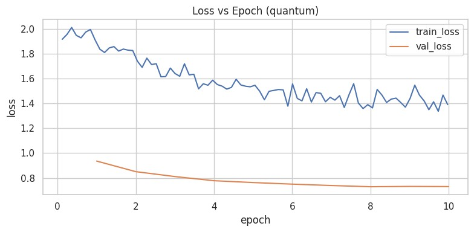
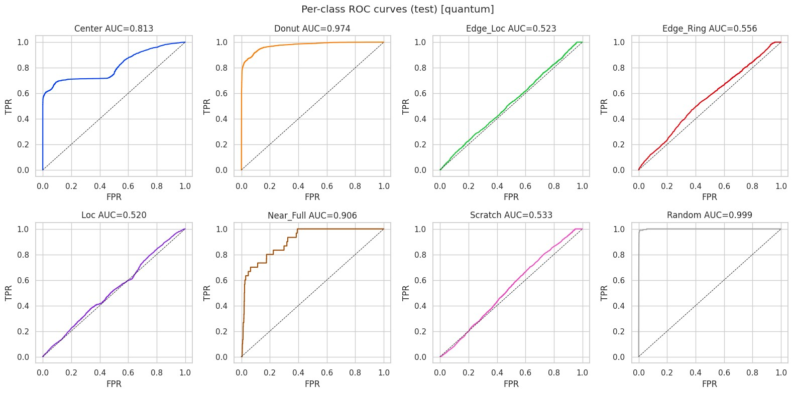
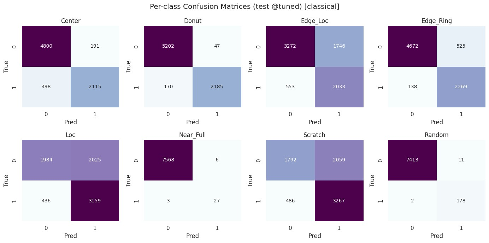
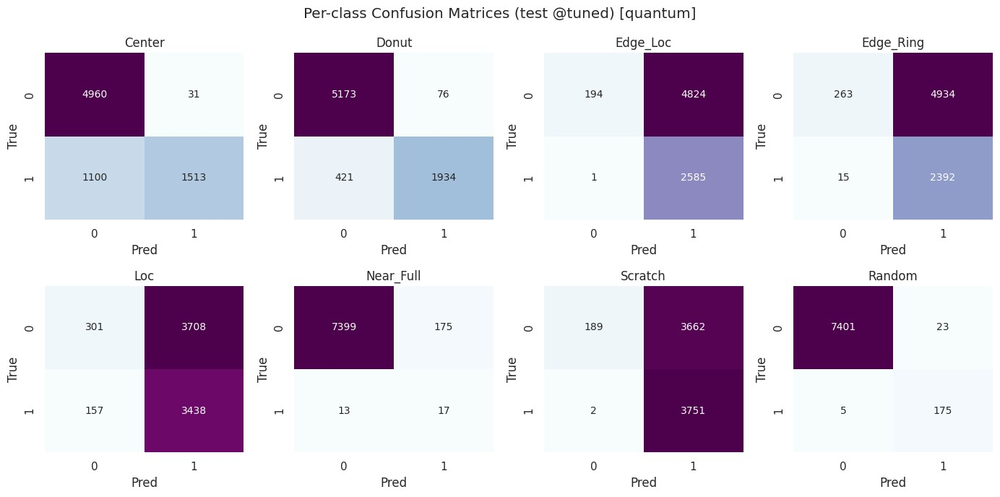
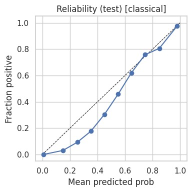
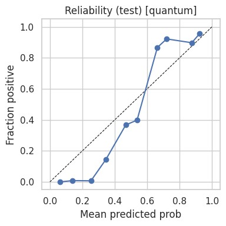

# Wafer Defect Classification: MambaVision Features with Classical and Quantum Heads

This repository benchmarks a **MambaVision backbone** with two interchangeable heads on **multilabel wafer-defect classification**:  
a **classical MLP head** and a **4-qubit PennyLane variational head** integrated as a `TorchLayer` for **end-to-end training and evaluation** under identical splits and hyperparameters.

---

## 📂 Datasets and Splits

- The NPZ dataset of wafer maps is split into **70% train**, **10% validation**, and **20% test**, and both variants use identical splits for fair comparison.  
- **Validation** is used for metric tracking and threshold tuning, while the **test set** is only used for final reports and plots.

---

## 🧠 Models

- **Backbone:** `nvidia/MambaVision-B-21K` at `224×224` inputs, with the final Linear replaced by `Identity` to expose penultimate features for a pluggable head.  
- **Heads:**
  - **Classical:** `Linear` → `ReLU` → `Dropout` → `Linear` to `NUM_LABELS` logits  
  - **Hybrid-Quantum:** `AngleEmbedding(4)` + `StronglyEntanglingLayers over 4 qubits` → `4 expectation values` → `Linear` to `NUM_LABELS` logits

---

## ⚙️ Training and Loss

- **Loss:** `BCEWithLogitsLoss` with per-class `pos_weight` from training-set prevalence to handle label imbalance.  
- **Metric Tracking:** Micro-F1 and Macro-F1 at a temporary 0.5 threshold during training for checkpoint selection.

---

## 🎯 Thresholding and Metrics

- **Per-class thresholds** are tuned on the validation set by sweeping decision thresholds and selecting the one maximizing per-class F1.  
- These tuned thresholds are applied to test probabilities for the **final classification report** and **confusion matrices**.  
- **Threshold-independent metrics:** per-class ROC-AUC and macro ROC-AUC on the test set.

---

## ⚡ Efficiency and Capacity

- Reports include:
  - Head trainable parameters  
  - Total trainable parameters  
  - Wall-clock times  
  - Throughput (images/s)  
  - Peak VRAM and CPU RAM  
  - PR-AUC, Brier score  
  - Bootstrap 95% CIs for Macro-F1 and Macro ROC-AUC  

All results are saved to `bench_reports/bench_{MODEL_VARIANT}.json`.

---

## 📊 Results Overview

### Key Results

| **Metric** | **Classical** | **Quantum** |
|:--|--:|--:|
| Head params | 264,456 | 4,164 |
| Total trainable | 264,456 | 4,164 |
| Val time (s) | 13.1298 | 22.5092 |
| Val throughput (img/s) | 289.4947 | 168.8642 |
| Test time (s) | 26.3930 | 45.6497 |
| Test throughput (img/s) | 288.1066 | 166.5729 |
| Peak VRAM (MB, test) | 558.352 | 555.377 |
| CPU RAM (MB, test) | 3386.992 | 3360.871 |
| Macro PR-AUC (test) | 0.8695 | 0.5585 |
| Brier score (test) | 0.0989 | 0.1716 |
| Macro F1 mean (95% CI) | 0.8221 [0.8080, 0.8336] | 0.6268 [0.6205, 0.6331] |
| Macro ROC-AUC mean (95% CI) | 0.9097 [0.9068, 0.9123] | 0.7282 [0.7218, 0.7350] |

---

## 📈 Interpretation

- **Accuracy:**  
  The classical head achieves higher Macro F1 and Macro ROC-AUC with tight confidence intervals, indicating stronger class-wise performance and ranking quality under identical training conditions.  

- **Calibration:**  
  The classical head yields a lower Brier score and higher Macro PR-AUC, implying better probability calibration and precision-recall characteristics, especially for rare defect types.  

- **Efficiency:**  
  The classical head evaluates faster in wall-clock time and throughput, while both variants have nearly identical peak VRAM under identical batch sizes and precision settings.  

- **Capacity:**  
  The hybrid-quantum head has **~4.2k parameters** compared to **~264k** for the classical head, demonstrating much greater **parameter efficiency**, though absolute accuracy currently lags due to simulator and circuit limits.

---


## 📊 Figures

### 1) Loss vs Epoch
| Classical | Quantum |
|:--:|:--:|
|  |  |

### 2) ROC Curves (Test)
| Classical | Quantum |
|:--:|:--:|
|  |  |

### 3) Confusion Matrices (Test @ Tuned)
| Classical | Quantum |
|:--:|:--:|
|  |  |

### 4) Reliability (Calibration)
| Classical | Quantum |
|:--:|:--:|
|  |  |

### 5) Per-Class AP (Test)
| Classical | Quantum |
|:--:|:--:|
|  |  |

---

## 🚧 Work in Progress

#### Ongoing improvements target both accuracy and reliability through:

- Circuit ablations (varying qubits and entangling layers)  
- Alternative angle embeddings  
- Threshold selection variants 
- Cost-sensitive evaluation  
- Regularization and optimizer schedule tuning  
- Matched-budget **LoRA** on the backbone  

Updated metrics and plots will be released in subsequent commits.

---

## 🔬 Reproducibility

- **Hardware:**  
  - Kaggle single **T4 GPU** for quantum runs (to avoid model replication)  
  - CPU fallback for quantum layer  
  - Avoid **P100** for `lightning.gpu`

- **Software:**  
  - Identical batch sizes, epochs, scheduler, loss, and thresholding  
  - Only `MODEL_VARIANT` changes between runs  
  - JSON reports saved to `bench_reports/` for transparent comparison across seeds and hardware

---

## 🧾 How to Regenerate

1. Set ``` MODEL_VARIANT="classical"``` then run the notebook end-to-end to produce figures and
bench_reports/bench_classical.json.

2. Set ``` MODEL_VARIANT="quantum"``` then run again the notebook end-to-end to produce figures and
bench_reports/bench_quantum.json.